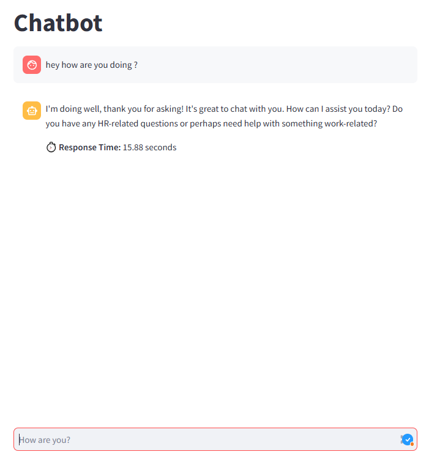

<h2>Description</h2>

Ollama Chatbot est une application interactive construite avec Streamlit et LangChain. Il permet aux utilisateurs d'interagir avec un chatbot alimenté par le modèle LLaMA via Ollama.

<h2>Prérequis</h2>
<ul>
    <li><strong>Python 3.11+</strong></li>
    <li><strong>Ollama</strong> installé sur votre machine (<a href="https://ollama.com/">Télécharger ici</a>)</li>
    <li><strong>Git</strong> installé</li>
</ul>

<h2>Installation</h2>
<h3>1. Cloner le dépôt</h3>
<pre><code>git clone https://github.com/Salma-chafiq/Chatboat.git
<h3>2. Créer un environnement virtuel</h3>
<pre><code>python -m venv venv</code></pre>

<h3>3. Activer l'environnement virtuel</h3>

<strong>Sous Windows :</strong>

<pre><code>venv\Scripts\Activate</code></pre>

<strong>Sous macOS/Linux :</strong>

<pre><code>source venv/bin/activate</code></pre>

<h3>4. Installer les dépendances</h3>
<pre><code>pip install -r requirements.txt</code></pre>

<h2>Exécution du Chatbot</h2>

Ouvrir un terminal dans VS Code ou votre éditeur préféré et exécuter la commande suivante :

<pre><code>streamlit run app.py</code></pre>

Une fois lancé, vous pourrez interagir avec le chatbot via l'interface Streamlit.

<h2>Fonctionnalités</h2>
<ul>
    <li>Interface interactive avec Streamlit.</li>
    <li>Gestion de l'historique des messages.</li>
    <li>Réponse rapide grâce à LLaMA via Ollama.</li>
    <li>Mesure du temps de réponse du chatbot.</li>
</ul>

<h2>Aperçu de l'exécution</h2>

<h2>Conclusion</h2>

Ce projet est un chatbot interactif utilisant LLaMA avec Streamlit et LangChain. Il permet une interaction fluide et peut être adapté à différents cas d'utilisation en changeant le rôle défini dans <code>SystemMessage</code>.

<h3>Améliorations possibles</h3>
<ul>
    <li>Ajouter une persistance des conversations avec une base de données.</li>
    <li>Permettre le choix entre différents modèles d'IA.</li>
    <li>Intégrer une interface plus avancée avec des boutons et options supplémentaires.</li>
</ul>

<strong>Auteur :</strong> Salma Chafiq

📌 <strong>Licence :</strong> MIT

